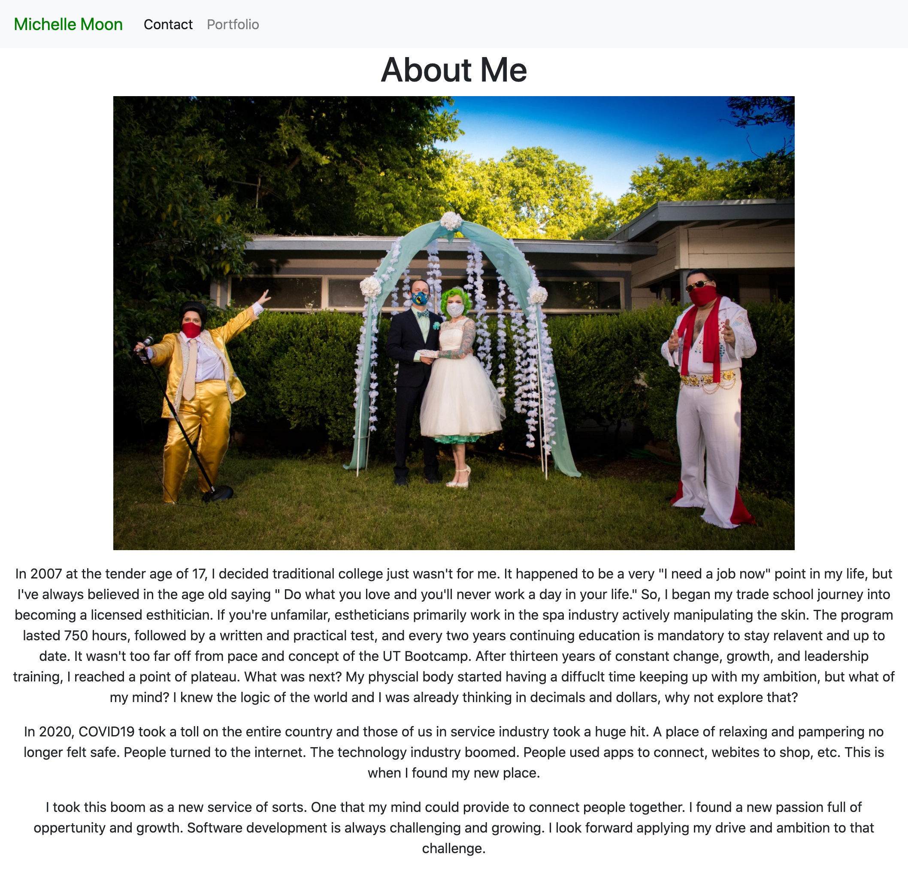
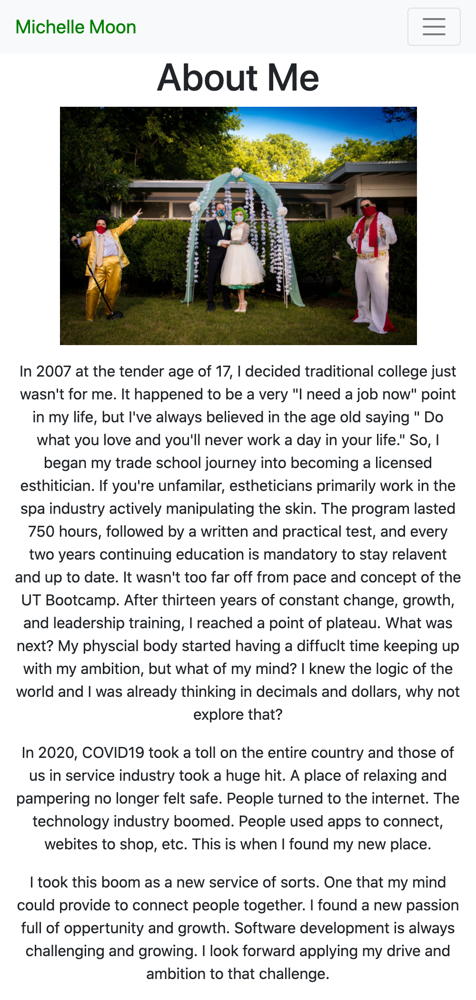
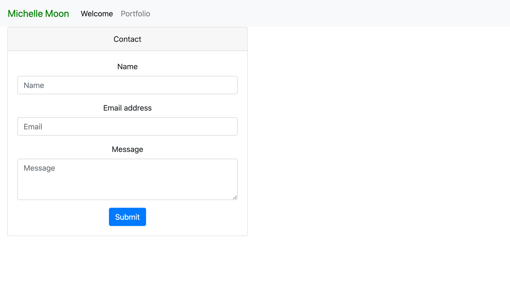
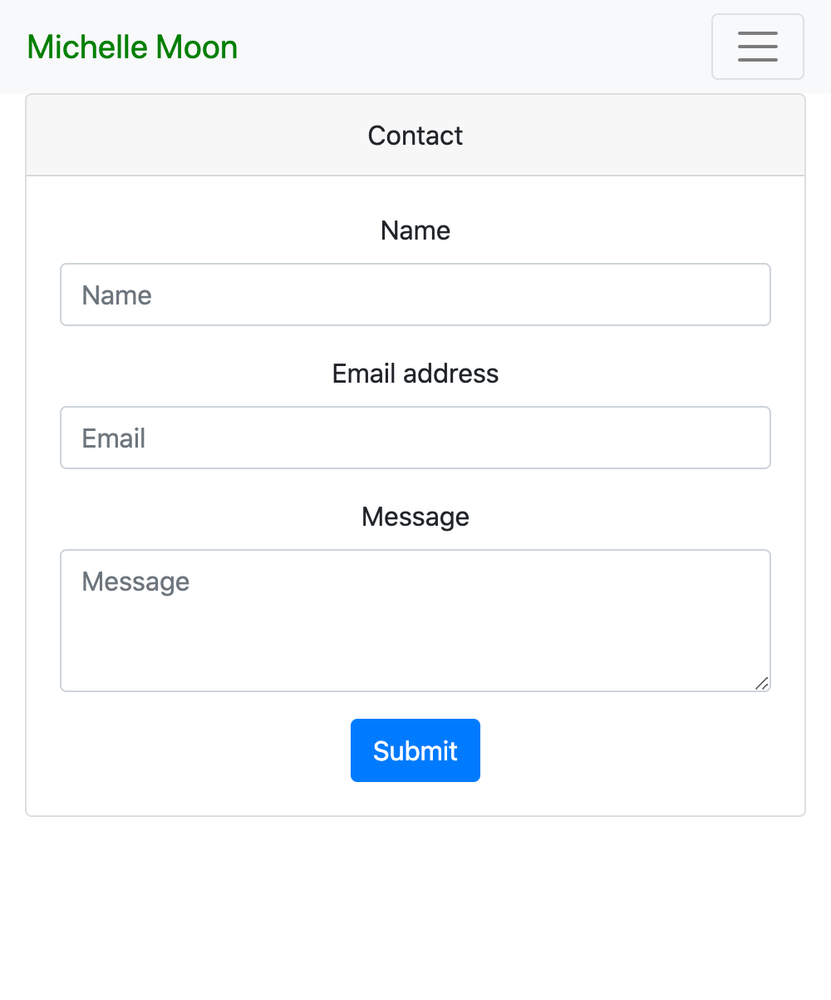
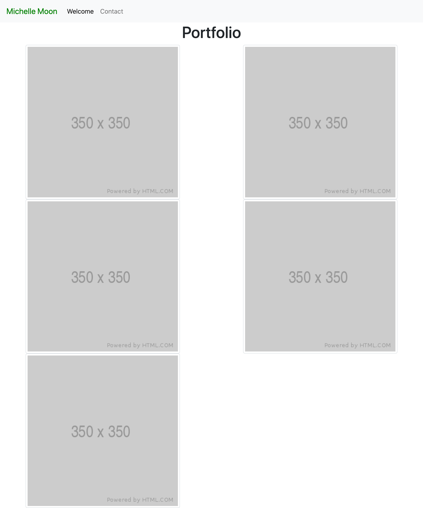
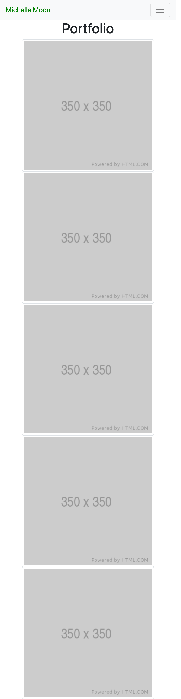

Bootstrap Portfolio

* Linked all three HTML documents together 
* Linked css and bootstrap
* Linked google font
* Used rows and column to create layout for content
* Used bootstrap to create cinsistent nav bar, a form card, and responsive images
* Used CSS to align and center content

https://github.com/Moon-Ingenium/Moon-Ingenium.github.io.git

